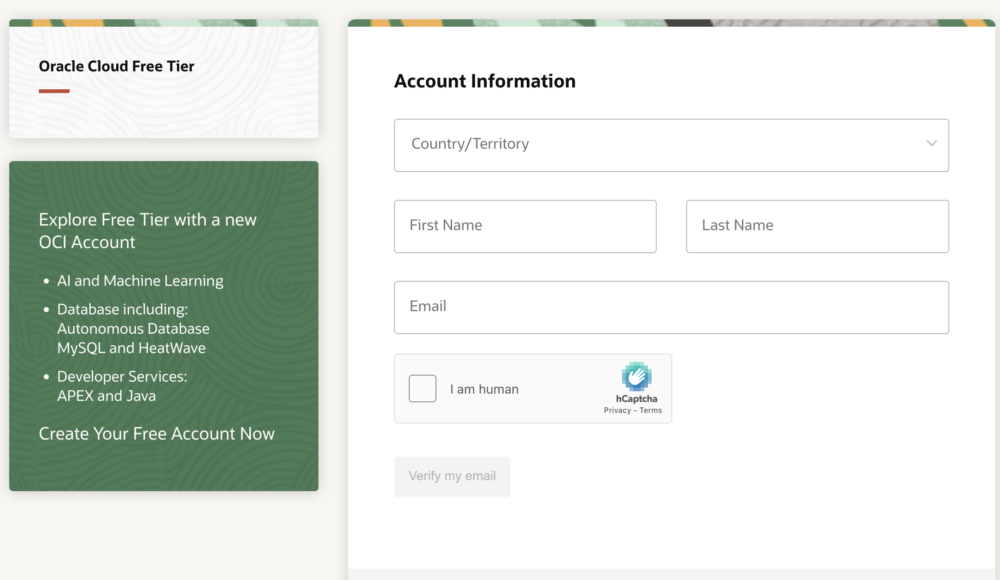
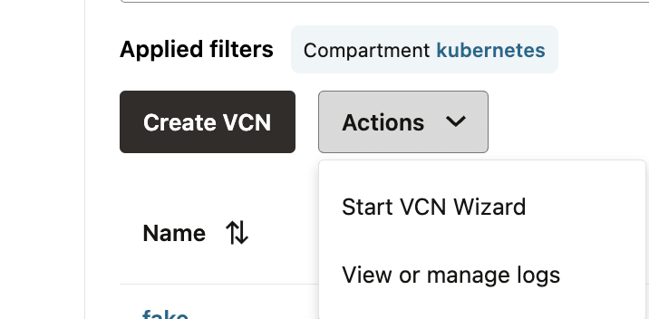
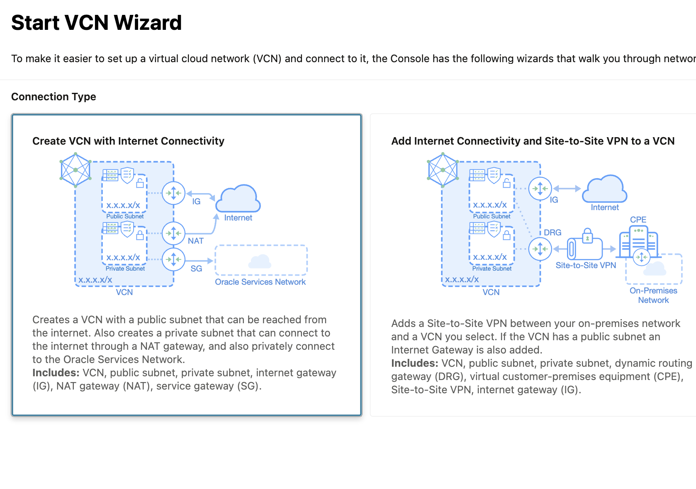
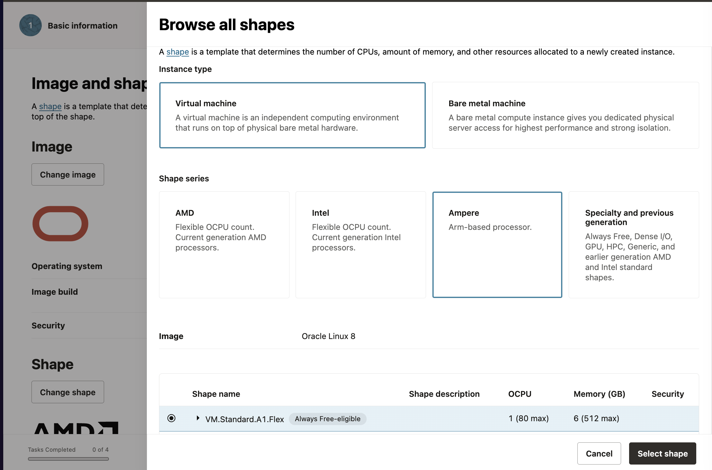
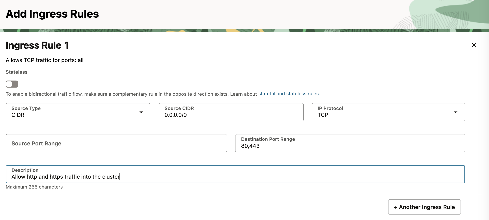
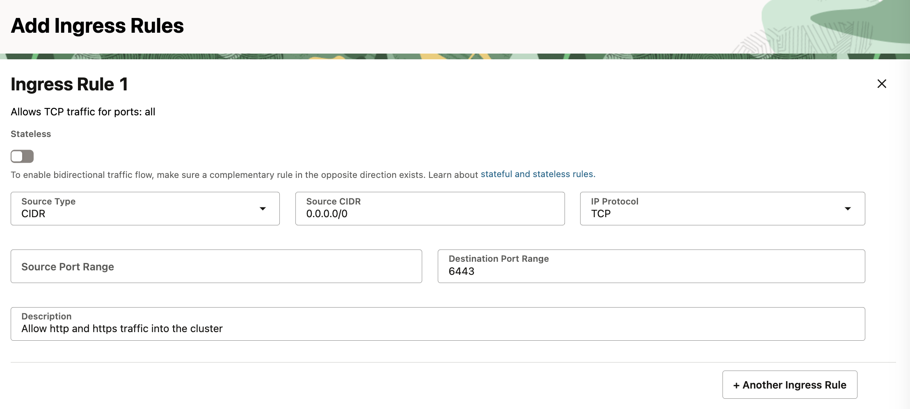

+++
date = '2025-04-22T00:41:02-05:00'
draft = true
title = 'Free Three Node Kubernetes cluster in Oracle Cloud'
+++

Learning Kubernetes for the first time or creating your own lab for practicing CKA exams? Tired of using kind or minikube in your undersized fanless laptop with 8GB memory?
I have been there and so have you. Let's create a 3-node Kubernetes cluster for free in Oracle Cloud.

## Table of Contents
  - [TLDR](#TLDR)
  - [Disclaimer](#Disclaimer)
  - [Setting Up Oracle Cloud](#setting-up-oracle-cloud)
  - [Budgeting and Alerts](#budgeting-and-alerts)
  - [Creating the Infrastructure](#creating-the-infrastructure)
  - [Kubernetes Setup](#kubernetes-setup)
    - [Kubeadm](#kubeadm)
    - [Installing Kubelet and Kubeadm](#installing-kubelet-and-kubeadm)
    - [Initialize the Cluster](#initialize-the-cluster)
    - [Install CNI](#install-cni)
  - [Tear Down the Cluster](#tear-down-the-cluster)
  - [What's Next](#whats-next)


## TLDR: 
Create 3 Oracle Cloud virtual machines with ARM Ampere CPU. The always free tier covers 3,000 OCPU hours and 18,000 GB hours per month, essentially 4 vCPU and 24GB RAM running 24 hours for a month. 

You can create a single VM or create 3 VMs: 1 Master node (2 vCPU + 12 GB Memory) and 2 worker nodes each with (1 vCPU and 6GB Memory). Create a cluster with kubeadm.

Alternatively, you can ignore the rest of this guide if you do not want to build your cluster manually. Oracle has a Basic Kubernetes Engine which is also free, providing a free control plane and add ARM Ampere VMs as worker nodes.

## Disclaimer
Although everything we do is free, you will still need a credit card for the **Pay as you go** model in Oracle Cloud account. This might sound like a marketing piece from Oracle Cloud but it is not. I am in no way associated with Oracle Cloud whatsoever.

What to expect in this article?
- Common gotchas with Oracle Cloud VM and its networking
- Kubeadm configuration and building the cluster

Let's begin then.

## Setting Up Oracle Cloud

### Check Out the Pricing
Before you create any resources double check the pricing from Oracle's pricing page for compute, storage and network.
https://www.oracle.com/cloud/free/

### Create Oracle Cloud Account

- Create an Oracle Cloud account. You can create a free tier Oracle cloud account but you are not likely to get any VMs because of out of capacity errors for free teir users. With Pay as you go, VMs are created instantly.


If you still like to remain in the free tier, check out this repo https://github.com/hitrov/oci-arm-host-capacity where they have scripts which try to provision VMs periodically. 


## Budgeting and Alerts

Before you create any resources in the cloud, it is extremely important to set your budgets and create alerts especially when you don't know what you are doing in the cloud.  Mistakes can be extremely costly while using the cloud, especially when you enter your credit card details.

1. Setup Budget alert. Set a threshold of $1 or even $0.00 so that once the cost is higher than that budget, you receive a notification.
2. Once you are done playing with the cluster for the day, stop the VMs so you do not consume compute resources.
3. If you delete the VMs make sure you aldo delete the volumes.

https://docs.oracle.com/en-us/iaas/Content/Billing/Tasks/create-alert-rule.htm

## Creating the Infrastructure

Now let's create the resources.

### Create Virtual Network (VCN) and Related Components

We can create a virtual network with a custom CIDR in Oracle Cloud. If you are coming from AWS and Azure, it should already be familiar to you. But for beginners, typical components in a virtual network are:

1. Virtual network (VCN)
2. Internet Gateway: Entry point to the network in the cloud
3. Subnets: Division of networks into smaller sizes to run different workloads
4. Route Table: Create routes between internet gateway, NATs, and local networks
5. NAT gateway: NAT is NAT. Please go ahead and google it. NAT gateways are free in Oracle, looking at you AWS 👀
6. Service Gateway: Connects Oracle Cloud services internally so that traffic does not need to route over the public internet
7. Security Lists: NACL in cloud
8. Network security group: Virtualized firewall outside the VMs or other services

There are a different ways to create a network and its related components:

1. Create each component of the network separately
2. Use VCN wizard to create all components swiftly
3. Don't create a network initially. Create a new network while creating a virtual instance. The console has an option to create a new VCN



with a VCN wizard if you are not aware of all the moving pieces of Oracle Cloud networking. In the future, we will create separate terraform configuration for compute instances and virtual networks.

While creating a VCN with the wizard, choose the option to create a VCN with internet connectivity.

, you can explore the subnets, gateways, route tables, and security lists.

### Compute Instances

We will be creating 3 VMs. Yes, we could create 4 VMs, but the Kubernetes control plane node requires at least 2 vCPUs. Our configuration will be:
- Master node: 2 vCPU, 12 GB Memory
- Worker node 1: 1 vCPU, 6 GB Memory
- Worker node 2: 1 vCPU, 6 GB Memory

Virtual machine configuration:
- Name: vm-name-count (for ex: master-node-01, worker-node-01, worker-node-02)
- Compartment: choose your default compartment
- Placement: AD-1 (the physical data center of Oracle)
- Capacity type (Under advanced options): On demand
- Image: Oracle Linux (based on CentOS) or choose Ubuntu
- Shape (Important): First choose **ARM** for shape series. Then choose shape to **VM.Standard.A1.Flex**. For the master node, choose OCPU value as 2 and Memory as 12 GB. For worker nodes, 1 OCPU and 6 GB. Double check the shape and note the `Always Free-eligible` badge when selecting the shape series. If you do not choose this series, you will burn money.



We can add a bash script to bootstrap the VM before we can access it. For now, we will not use it and manually run our init scripts.
- Tags: Add helpful tags to document the workload.
- Networking:
  - Virtual network: In the networking section, choose the virtual network we created earlier from the dropdown or create a new network if you have not created a VCN yet or did not want to create beforehand.
  - Subnets: For subnet, choose the public subnet. It is not the best practice to run Kubernetes in a node with a public IP in a public subnet, but for testing and lab purposes, we will run it in a public subnet. In the next article, we will create the cluster entirely in a private subnet.
  - Auto assign public IP: Yes
- SSH keys: If you already have an SSH key pair, upload the public key. Otherwise, create an SSH key and download the key pair. Use the same key pair for all VMs for now.
- Boot volume size: If we do not choose anything, Oracle will attach a 50GB volume, but if we were to specify, the minimum size will be 52GB. Therefore, leave it as it is. Make sure to read this doc before adding a block volume so that you stay under the free tier: https://docs.oracle.com/en-us/iaas/Content/FreeTier/freetier_topic-Always_Free_Resources.htm

At the end, we can view the estimated cost of the resources we will be creating. It shows $2.00 per month. But those charges will not be incurred if we stay within the free tier. I have been running my VMs for months and have not incurred any cost yet. If it sounds good to you, go ahead and create the VMs.

### Connecting to the VMs

It will take a minute or two for the VMs to provision and be ready. You can find the public IP address of the VMs in their networking tab or in the list of VMs itself.

Depending on the Linux OS you chose, the default username would be 'ubuntu' for Ubuntu and 'opc' for Oracle Cloud Linux, or it will be a custom username if you chose one.

Now we can test SSH as:

```
ssh -i path-to-private-key-file username@public_ip
```

For example:

```
ssh -i /home/macgain/ORACLE/private-key opc@172.124.12.49
```

Oracle Cloud's networking by default allows ingress SSH port 22.

Here is a quick tip for SSHing: You don't want to type out the whole SSH command and remember the IP address of all of your VMs. If you haven't done so already, just go ahead and create a config file in the ~/.ssh directory and add an entry like this in the file for each of your VM:

```
Host c1
    HostName  your-vms-public-ip-address
    Port 22 # ssh port
    User ubuntu # or custom username
    IdentityFile ~/Downloads/ORACLE/keys/oracle-cloud.key # path to your ssh private key file
    PubkeyAuthentication yes
```

After adding entries for all VMs, you can SSH by using just `ssh c1` or `ssh w1` or `ssh w2`.

### Oracle Linux's Networking Gotchas

Before creating a Kubernetes cluster with kubeadm, we need to open ports in the VMs and in the network. Kubernetes needs ports 6443 (kube api server), 10250 (kubelet api), and 30000-32767 for NodePort services.

In other clouds, we would typically allow the ports in Security groups and NACLs for ingress, which we will have to do in Oracle Cloud networking as well.

Go to Oracle Cloud network's default security list and add the rules to allow ingress access on these ports.

In VCN's menu, go to security > security list. Choose the default security list and then add ingress rules.
Add an ingress rule to allow ports 80 and 443 for HTTP traffic.

 6443 for accessing the kube api server with kubectl.

(for kubelet API) and for worker nodes' usage add 10256 (kube-proxy) and 30000-32767 (for NodePort service).

More information on ports here: https://kubernetes.io/docs/reference/networking/ports-and-protocols/

When Oracle Linux is used, use firewall-cmd to open the ports:

```bash
sudo firewall-cmd --permanent --zone=public --add-port=80/tcp; 
sudo firewall-cmd --permanent --zone=public --add-port=443/tcp; 
sudo firewall-cmd --permanent --zone=public --add-port=6443/tcp; 
sudo firewall-cmd --permanent --zone=public --add-port=10250/tcp; 

sudo firewall-cmd --reload

```

In case of Ubuntu, oracle cloud recommends not to use UFW because it alters pre-configured rules but instead use `iptables` directly to open ports. In Ubuntu iptables is pre configured to allow Oracle's internal IP addresses and SSH port. Even if we allow other ports from security lists or network security groups, those ports will not be accessible unless we add the iptables rules. 

https://docs.oracle.com/en-us/iaas/Content/Compute/known-issues.htm#ufw

After SSHing to all three nodes, we need to update the iptables rules in Oracle Linux to allow the ports 6443, 10250, 10256, 80, and 443.


```
sudo iptables -I INPUT 6 -m state --state NEW -p tcp --dport 80 -j ACCEPT
sudo iptables -I INPUT 6 -m state --state NEW -p tcp --dport 443 -j ACCEPT

sudo iptables -I INPUT 6 -m state --state NEW -p tcp --dport 6443 -j ACCEPT
sudo iptables -I INPUT 6 -m state --state NEW -p tcp --dport 10250 -j ACCEPT

sudo netfilter-persistent save
```

> NOTE: If we could need access to other ports if we use NodePort service in our cluster to expose the apps running in the cluster. The NodePort's port range 30000 to 32767 might be needed to added in the iptables rules or firewall-cmd depending on the Linux distro.

## Kubernetes Setup

### Kubeadm

Once the ports are open, finally we can prepare our VMs for running Kubernetes.
For the VMs to run containers with Kubernetes in each of the nodes, the following components need to be installed:
1. A container runtime (podman, crio, containerd)
2. Kubeadm (Kubernetes tool for creating and managing the cluster)
3. Kubelet: Kubelet is needed in every node so that nodes can join the cluster and connect to Kube API server

### Prepare the VMs

#### Disable the Swap

For running containers, Kubernetes recommends disabling the swap:
```
sudo swapoff -a
sudo sed -i '/swap/d' /etc/fstab
```

#### Load Overlay and br_netfilter Kernel Modules

These modules are necessary to manage traffic within the cluster. `modprobe` command is used to load kernel modules into the OS. br_netfilter allows bridge traffic (like that between pods or containers on different hosts) to be seen and filtered by iptables.

```
sudo modprobe overlay
sudo modprobe br_netfilter
```

Enable IP forwarding in each of the hosts. Adding the configuration allows bridged traffic between pods and allows IP forwarding between pods and hosts:

```
sudo tee /etc/sysctl.d/k8s.conf&1

sudo systemctl status containerd
```

Instead of running all these commands one by one, we will create a handy little script which we can pass as an init script while creating the VM. This script needs to be run on both master and worker nodes.

You can find the full script over at the github repository.
--> github repo link here

Download the script from the github link and create a file named `init-vm.sh` in each of your VMs.
Make it executable and run the script with sudo:
```
sudo chmod +x init-vm.sh
sudo ./init-vm.sh
```

When the execution of the script is complete, check the status of the kubelet service; it should be loaded:

```
systemctl status kubelet
```

Check the versions of kubeadm and kubectl and make sure they are the configured version:

```
kubectl --version
kubeadm --version
```

Check the firewall status. In Ubuntu, check ufw; in Oracle Linux, check firewalld status and check if the required ports are allowed:

```bash
# ubuntu
sudo ufw status # should be disabled or not installed

# oracle linux
sudo firewall-cmd --state
sudo firewall-cmd --list-all  # should show the open ports 80, 443, 6443, 10250

```

## Initialize the Cluster

In the master node, we will use kubeadm to initialize the cluster with the following commands. An important consideration before creating a cluster: choose the Pod network CIDR wisely because it cannot be changed, and it determines the number of usable IP addresses. For lab purposes, a CIDR of /16 or /24 is enough.

The command below initiates the cluster:

```
# create a variable to keep the private IP address of the node
CONTROL_PLANE_PRIVATE_IP=$(ip -4 addr show scope global | grep inet | awk '{print $2}' | cut -d/ -f1)
POD_CIDR="172.16.0.0/24"
    
sudo kubeadm init --apiserver-advertise-address $CONTROL_PLANE_PRIVATE_IP \
--pod-network-cidr=$POD_CIDR \
--apiserver-cert-extra-sans "public_ip_of_master_node" \
--upload-certs --v=5
```
`apiserver-advertise-address` should be the private IP address of the master node. To make the kube api server accessible from public internet `apiserver-cert-extra-sans` should be set to a public IP address 


It will take 3-4 minutes for the cluster to be created. If it succeeds, the stdout will provide a token that can be used to join the cluster. Copy the kubectl join command along with the token from the stdout. The join command looks something similar to this:
```
kubeadm join 10.0.0.23:6443 --token 54o3tf.age34 \
        --discovery-token-ca-cert-hash sha256:97caa855c032d964b8b2e9c23cf495b0d208fd2ae38d7eawf342
       
```

The Kubernetes config, aka kubeconfig, is stored at /etc/kubernetes/admin.conf. Copy it to the home directory as:

```
mkdir -p $HOME/.kube
sudo cp -i /etc/kubernetes/admin.conf $HOME/.kube/config
sudo chown $(id -u):$(id -g) $HOME/.kube/config
```

Now we can run the `kubectl` command against the cluster.

We will copy this kubeconfig file to our local machine and change the IP address in the server section to the public IP address of the control plane node. That way, we can access the cluster locally.

## Install CNI

If you run the `kubectl get nodes` command, the status of the control plane is `NotReady`. This is because we have not installed CNI (Container Networking Interface) yet. Before adding the worker nodes to the cluster, install a CNI. There are many CNI options to choose from: Calico, Flannel, Cilium, and many more. We can install Cilium by applying its manifest file with kubectl.

Once the Cilium pods are running and the master node is ready, we will join the worker nodes to the cluster with the `kubectl join` command.

SSH into both of the worker nodes and paste the `kubectl join` command that was saved earlier.

Once again, run `kubectl get nodes`. It should show 3 nodes, and the status should be `READY`.

Now we can run containers in our cluster:

```
kubectl run nginx --name nginx
```

Run `kubectl get pods`, and it should show nginx running.


To access the cluster from your own machine , copy the ~/.kube/config file to your own own file and edit the server's IP address in the config file:
```
apiVersion: v1
clusters:
- cluster:
    certificate-authority-data: example-text
    server: https://your server's ip address's public ip address:6443
  name: kubernetes
contexts:
- context:
    cluster: kubernetes
    user: kubernetes-admin
  name: kubernetes-admin@kubernetes
current-context: kubernetes-admin@kubernetes
kind: Config
preferences: {}
users:
- name: kubernetes-admin
  user:
    client-certificate-data: example-text
    client-key-data: example-text
```


## Tear Down the Cluster

If you are done playing with the cluster and do not want it anymore, you can just reset it with kubeadm:

```
sudo kubeadm reset
```

## What's Next

1. In the next article in this series, we will automate this process by writing terraform to create and manage all of Oracle Cloud resources.
2. Create a private Kubernetes cluster.
3. Bootstrap the cluster with basic necessities like Ingress controller, monitoring and observability, cert manager, and many more.
4. Implement GitOps in the cluster.